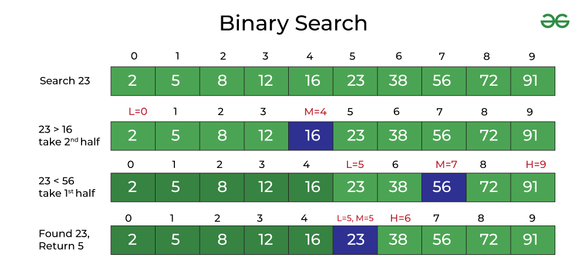

# Simple Search & Binary Search

**Introduction to Binary Search** Binary search is an efficient algorithm for finding an item from a sorted list of items. It works by repeatedly dividing in half the portion of the list that could contain the item, until you've narrowed down the possible locations to just one.

**How Binary Search Works** First, you look at the middle number. If it's the one you're searching for, you're done! If your number is bigger, then you know it has to be in the higher half of your list. But if it's smaller, you'll check the lower half. You keep splitting the list in half like this until you find your number or run out of places to look.

**Why Use Binary Search?** Binary search is great because it's fast. For a list of a million numbers, it would take you, at most, about 20 guesses to find the number or conclude it's not there. That's way faster than looking through each number one by one.

**When to Use Binary Search** This search method is perfect for when you have a big list that's already sorted. You might use it in computer programs that need to find items quickly, like looking up movie times, searching through contacts, or finding a book in an online store.

<figure><figcaption><p>binary serch</p></figcaption></figure>


```javascript
function binarySearch(array, target, min = 0, max = null) {
    if (max === null) {
        max = array.length - 1;
    }

    if (min > max) {
        return -1;  
    }

    let mid = Math.floor((min + max) / 2);

    if (array[mid] === target) {
        return mid;  
    } else if (array[mid] < target) {
        return binarySearch(array, target, mid + 1, max);  
        return binarySearch(array, target, min, mid - 1);  
    }
}

```

#### Recursive binary search&#x20;

